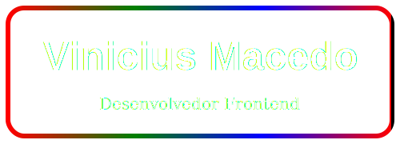

# Olá, seja bem vindo!

<!--
**ViniciusMBotelho/ViniciusMBotelho** is a ✨ _special_ ✨ repository because its `README.md` (this file) appears on your GitHub profile.

Here are some ideas to get you started:

- 🔭 I’m currently working on ...
- 🌱 I’m currently learning ...
- 👯 I’m looking to collaborate on ...
- 🤔 I’m looking for help with ...
- 💬 Ask me about ...
- 📫 How to reach me: ...
- 😄 Pronouns: ...
- ⚡ Fun fact: ...
-->

  

  
  
  
  
  
  

## 💬 Sobre mim 
Sou graduando em Ciência da Computação no **Instituto Federal do Norte de Minas Gerais** e sou apaixonado por criar interfaces interativas, robustas e responsivas que conectam pessoas aos seus objetivos. Atualmente, estou focado em construir uma carreira sólida no desenvolvimento **frontend**, considerando isso apenas o primeiro passo de uma jornada de crescimento. Minha motivação vem da constante busca por novos desafios e do ciclo contínuo de aprendizado, onde ver meus projetos tomando forma e evoluindo me impulsiona a aprender mais e me aprimorar. Esse processo de crescimento e realização é o que me mantém sempre motivado.

## 📫 Onde me encontrar

 
  
   

## 📈 Estatísticas do Github 

  
  

